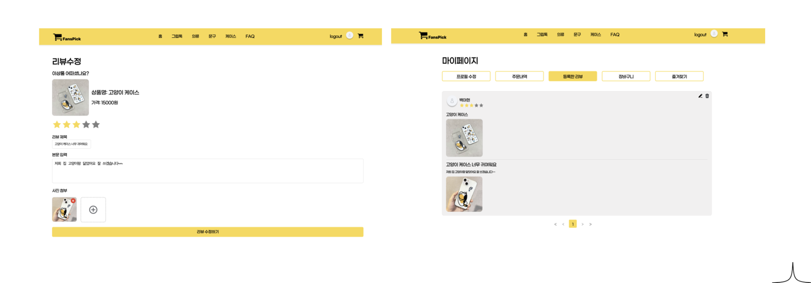

# 🛍️ FansPick - 굿즈 판매 사이트

> 이 프로젝트는 일반 사용자는 굿즈를 구매하고, 판매자는 상품을 등록할 수 있는 온라인 마켓입니다.

> 🔗 [배포 링크 바로가기](https://web-fanspick-front-m88gjvsd5fb295a9.sel4.cloudtype.app/)

## ⏱️ 프로젝트 개요

- 기간: 2025.01.03 ~ 2025.01.16 (2주)
- 인원: 4명(프론트,백 같이)
- 담당 역할: - 메인 페이지 & 카테고리별 페이지

## 📌 프로젝트 소개

**FansPick**은 판매자와 사용자가 각자 역할에 맞게 참여할 수 있는 **굿즈 커머스 플랫폼**입니다.  
판매자는 상품을 등록하고 관리할 수 있으며, 사용자는 다양한 굿즈를 구매할 수 있습니다.  
회원가입 시 역할을 선택할 수 있고, 역할에 따라 이용 가능한 기능이 분리되어 있어 실제 서비스처럼 구체적인 시나리오를 경험할 수 있도록 구현되었습니다.

## 🛠️ Skills

- **Frontend**: React, TypeScript, Tailwind CSS, Zustand, React Router
- **Backend**: Node.js, Express, MongoDB
- **DevOps / Infra**: AWS S3 (이미지 업로드), Cloudtype
- **Design**: Figma

## 👨‍💻 주요 기능

### ✴️ 메인 페이지 & 카테고리별 페이지

- 전체 상품 리스트를 불러와 메인 화면에서 노출
- 카테고리별 필터링 기능 구현하여 특정 굿즈만 조회 가능

### ✴️ 즐겨찾기 & 장바구니 기능 (LocalStorage 활용)

- 상품 즐겨찾기, 장바구니(비회원 포함) 기능

### ✴️ 구매하기 페이지 & 결제 시스템

- 포트원(PortOne) 결제 API를 연동하여 카드 결제, 카카오 간편 결제 기능 구현

### ✴️ 리뷰 페이지

- 상품에 대한 리뷰 추가,수정,삭제 기능

### ✴️ 유저 프로필

- 내 프로필 조회(리뷰,주문내역,장바구니 등등) 가능

## 📷 주요 ui

- 로그인 페이지

  

- 메인 페이지

  

- 상품 상세 페이지

  

- 주문,결제 페이지

  

- 유저 프로필 페이지

    

- 리뷰 페이지

  

- 판매자 페이지

  

---

## 📂 프로젝트 실행 방법

```bash
# [프론트엔드]

npm install
npm run dev

# [백엔드]

npm install
node index.js
```
